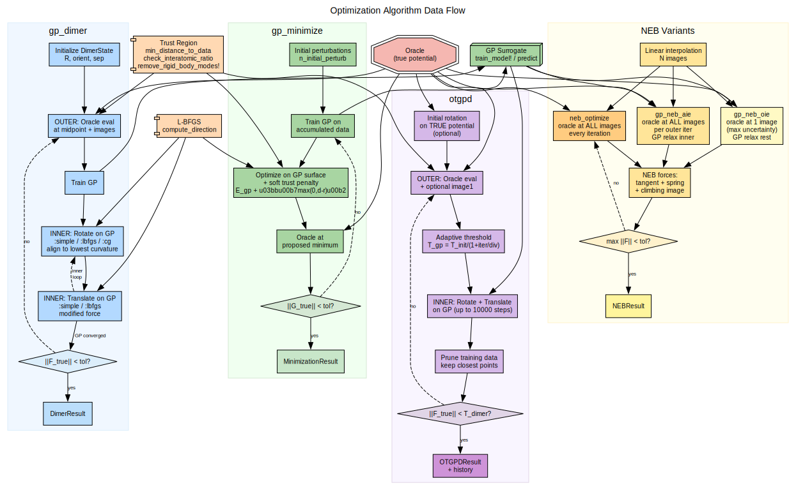
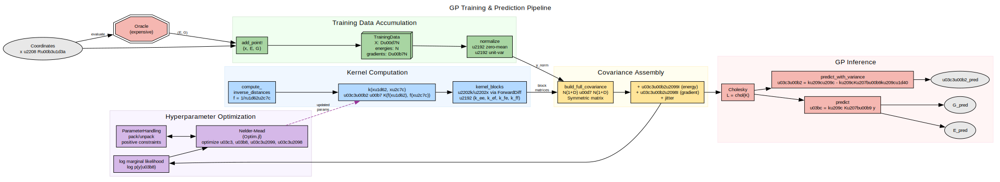
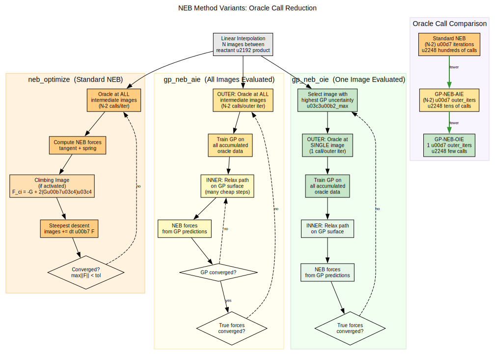

# Algorithm Pseudocode

Pseudocode for all GP-guided optimization methods in ChemGP.

## Optimizer Data Flow



## GP Training & Prediction Pipeline



## GP Minimization ([`gp_minimize`](@ref))

```
Input: oracle, x_init, kernel, config
Output: MinimizationResult

1. Generate initial training data (perturbations around x_init)
2. x_best = argmin_E(training_data), stagnation = 0
3. for outer_iter = 1:max_iter
   a. Phase selection: use_gp = cyclic_schedule(stagnation)
   b. If use_gp:
      - Train GP (SCG + analytical NLL grad for mol kernels)
      - If rff_features > 0: build RFF from trained kernel
      - x_cand = L-BFGS_minimize(LCB_surface, x_best)
      - Apply Kastner overshooting along consistent descent
   c. Else (L-BFGS fallback):
      - x_cand = x_fb + optim_step!(lbfgs, x_fb, -G_fb)
   d. Trust clip + per-atom max-move clip
   e. Evaluate oracle at x_cand
   f. Add to training data (dedup, FPS prune if needed)
   g. If E < E_best or force decreased: accept, reset stagnation
      Else: stagnation++, advance fallback trajectory
   h. Check: max_per_atom_force(G) < conv_tol → CONVERGED
```

## SCG Hyperparameter Optimization ([`scg_optimize`](@ref))

```
Input: fg!(f_ref, g_vec, w), w0, config
Output: (w_best, f_best, converged)

Scaled Conjugate Gradient (Moller 1993). Used for MAP NLL optimization
of molecular kernel hyperparameters in log-space with analytical gradients.

1. r = gradient(w), p = -r, lambda = 1.0
2. for iter = 1:max_iter
   a. If success:
      - mu = p'r (must be < 0 for descent)
      - kappa = p'p; sigma = sigma0/sqrt(kappa)
      - Finite-diff Hessian-vector product: gamma = p'(g(w+sigma*p)-r)/sigma
   b. delta = gamma + lambda*kappa
      If delta <= 0: delta = lambda*kappa, lambda -= gamma/kappa
   c. alpha = -mu/delta; w_new = w + alpha*p
   d. Evaluate f_new, g_new at w_new
   e. comparison = 2*(f_new - f_old)/(alpha*mu)
   f. If comparison >= 0: accept, Polak-Ribiere CG update
      Else: reject, success = false
   g. Adjust lambda: *4 if comparison < 0.25, *0.5 if > 0.75
   h. Convergence: |alpha*p| < tol_x, |df| < tol_f, or ||g|| < eps
```

## GP-Dimer ([`gp_dimer`](@ref))

```
Input: oracle, x_init, orient_init, kernel, config
Output: DimerResult

1. Initialize DimerState(R, orient, dimer_sep)
2. Generate initial training data
3. for outer_iter = 1:max_outer_iter
   a. Train GP on accumulated data
   b. Reset L-BFGS/CG state
   c. Inner loop (on GP surface):
      - Rotate: align with lowest curvature mode
        (:lbfgs/:cg → search direction + Newton angle opt)
        (:simple → direct angle estimate)
      - Translate: modified force F_trans = G - 2(G·n̂)n̂
        Negative curvature: L-BFGS step
        Positive curvature: fixed step along -G·n̂
      - Check: |F_trans| < T_gp → break
      - Check: trust radius → break
   d. Oracle at converged position (+ image 1)
   e. Check: |F_true| < T_dimer AND C < 0 → CONVERGED
```

## OTGPD ([`otgpd`](@ref))

```
Input: oracle, x_init, orient_init, kernel, config
Output: OTGPDResult

Initialize: HODState (if use_hod), training data, dimer state

Phase 1 -- Initial Rotation (optional):
  for rot = 1:max_initial_rot
    Evaluate oracle at midpoint + image 1
    Compute F_rot, curvature C
    Modified Newton angle optimization (parabolic fit):
      d_theta = 0.5 * atan(|F_rot|/|C|)
      Trial rotation, evaluate oracle
      Fit F(theta) = a1*cos(2*theta) + b1*sin(2*theta)
      theta* = 0.5 * atan(b1/a1)
    Check: d_theta < T_angle -> break

Phase 2 -- Main GP Loop:
  for outer_iter = 1:max_outer_iter
    Prune training data (if max_training_points > 0)

    FPS subset selection:
      fps_size = hod_state.current_fps_history (dynamic via HOD)
      Select fps_latest_points most recent + FPS from rest
      td_sub = extract_subset(td, selected_indices)

    Compute barrier strength: beta = min(1e-4 + 1e-3*n_sub, 0.5)

    Train GP (two-path strategy):
      IF kernel isa AbstractMoleculeKernel:
        Energy shift (not normalize), fix_noise=true
        Warm-start kernel from previous iteration
        NLL with variance barrier (barrier_strength = beta)
      ELSE:
        Normalize, optimize noise as free parameter
      Optimize hyperparams on td_sub, rebuild model on full td

    HOD check:
      Extract log-space hyperparams, count sign-flips
      If flip_ratio > threshold -> enlarge FPS subset

    Adaptive threshold: T_gp = max(min(F_history)/divisor, T/10)
    Adaptive trust: T_trust = sigmoid(n_data/n_atoms) or fixed

    Inner loop (on GP surface):
      Rotate, translate (L-BFGS or simple)
      Check: |F_trans| < T_gp -> GP converged
      Check: trust_distance(R_new, td, metric) > T_trust -> scale step
      Check: interatomic ratio -> reject distortion

    Oracle evaluation (+ image 1 if eval_image1)
    Check: |F_true| < T_dimer AND C < 0 -> CONVERGED
```

## NEB Variants Overview



## Standard NEB ([`neb_optimize`](@ref))

```
Input: oracle (or oracle pool), x_start, x_end, config
Output: NEBResult

1. Linear interpolation -> N images
2. Evaluate oracle at all images (parallel if pool)
3. for iter = 1:max_iter
   a. Compute tangent at each image (improved method):
      - Monotonic increase: tau = R_{i+1} - R_i
      - Monotonic decrease: tau = R_i - R_{i-1}
      - Extremum: energy-weighted average
   b. NEB force at each image:
      - Standard: F = -G_perp + F_spring_parallel
      - Climbing image: F = -G + 2(G . tau_hat) tau_hat
   c. Steepest descent update
   d. Re-evaluate oracle at all images (parallel if pool)
   e. Check: max|F| < conv_tol -> CONVERGED
```

## GP-NEB-AIE ([`gp_neb_aie`](@ref))

```
Input: oracle (or oracle pool), x_start, x_end, kernel, config
Output: NEBResult

1. Linear interpolation, evaluate oracle at all images (parallel if pool)
2. Initialize prev_kern = nothing (for warm-start)
3. for outer_iter = 1:max_outer_iter
   a. Compute true NEB forces, check convergence
   b. Train GP on accumulated data:
      - Warm-start: reuse prev_kern if available
      - Molecular kernel: energy shift, fix_noise, regularized noise
      - Other kernel: normalize, optimize noise
      prev_kern = model.kernel
   c. Inner loop: relax path on GP surface
      - GP-predict E, G at all intermediate images
      - Compute NEB forces from GP predictions
      - Steepest descent on GP
   d. Evaluate oracle at ALL new image positions (parallel if pool)
   e. Add to training data (dedup by min distance)
```

## GP-NEB-OIE ([`gp_neb_oie`](@ref))

```
Input: oracle, x_start, x_end, kernel, config
Output: NEBResult

1. Linear interpolation, evaluate midpoint
2. Initialize prev_kern = nothing (for warm-start)
3. for outer_iter = 1:max_outer_iter
   a. Train GP on accumulated data (warm-start from prev_kern)
      - If max_gp_points > 0: FPS subset for hyperparameter training
      - If rff_features > 0 and MolInvDistSE and N > M_subset:
        Build RFF model on ALL data using trained hyperparameters
   b. Predict E, G at all images (from GP or RFF model)
   c. Compute predictive variance at all images
   d. Select image i* = argmax(variance_E)
   e. Evaluate oracle at image i* (single call, no parallelism)
   f. Inner loop: relax path on GP surface
   g. Check convergence (all images evaluated + max|F| < tol)
```

## Modified Newton Rotation

```
Input: state, model, F_rot_direction, config
Output: curvature_estimate

1. C₀ = curvature at current orientation
2. dθ = 0.5 * atan(|F_rot|/|C₀|)
3. Trial rotation: orient_trial = cos(dθ)·orient + sin(dθ)·F̂_rot
4. Evaluate GP at trial image 1 position
5. Parabolic fit:
   F₀ = F_rot·F̂_rot  (projection at θ=0)
   F_dθ = F_rot_trial·F̂_rot_trial  (projection at θ=dθ)
   a₁ = (F_dθ - F₀·cos2dθ) / sin2dθ
   b₁ = -F₀/2
6. θ* = 0.5 * atan(b₁/a₁), adjust for minimum
7. Apply rotation: orient_new = cos(θ*)·orient + sin(θ*)·F̂_rot
```

## L-BFGS Two-Loop Recursion

```
Input: history (s,y pairs), gradient g
Output: search direction d

1. q = g
2. for i = m, m-1, ..., 1:   (newest to oldest)
   α_i = (s_i·q) / (y_i·s_i)
   q = q - α_i·y_i
3. γ = (s_m·y_m) / (y_m·y_m)  (Rayleigh quotient scaling)
4. d = γ·q
5. for i = 1, 2, ..., m:      (oldest to newest)
   β = (y_i·d) / (y_i·s_i)
   d = d + (α_i - β)·s_i
6. return d
```
