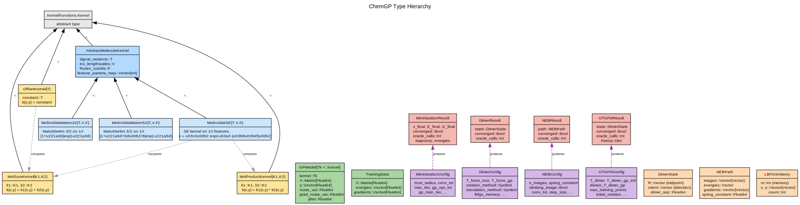
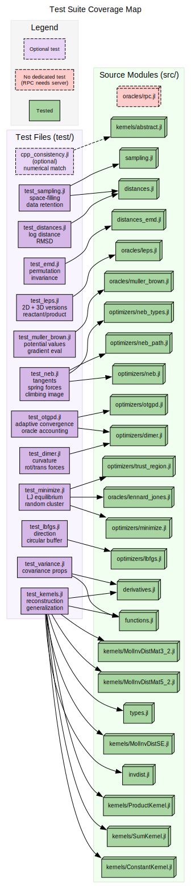

# Codebase Comparison

Mapping between ChemGP (Julia), gpr\_dimer\_matlab (MATLAB), and gpr\_optim (C++).

## ChemGP Type Hierarchy

## Test Coverage Map

## Kernel Functions

| ChemGP | MATLAB | C++ |
|:-------|:-------|:----|
| `MolInvDistSE` | `gpcf_sexp` (GPStuff) | `CovSEard` |
| `MolInvDistMatern52` | — | `CovMatern52` |
| `MolInvDistMatern32` | — | — |
| `OffsetKernel` | `gpcf_constant` | `CovConst` |
| `MolSumKernel` | Additive composition | `CovSum` |
| `MolProductKernel` | — | `CovProd` |
| `compute_inverse_distances` | Inline in kernel | `InverseDistanceFeatures` |

## GP Core

| ChemGP | MATLAB | C++ |
|:-------|:-------|:----|
| `build_full_covariance` | `gp_trcov` (GPStuff) | `GPModel::computeK` |
| `train_model!` (Nelder-Mead) | `gp_optim` (SCG) | `GPModel::optimize` (SCG) |
| `predict` | `potential_gp.m` | `GPModel::predict` |
| `predict_with_variance` | — | `GPModel::predictWithVar` |
| `TrainingData` | `R_all, E_all, G_all` | `TrainingData` |
| `normalize` | Inline | `TrainingData::normalize` |

## Optimizers

| ChemGP | MATLAB | C++ |
|:-------|:-------|:----|
| `gp_minimize` | — | `GPMinimize` |
| `gp_dimer` | `GP_dimer.m` | `Dimer.cpp` |
| `otgpd` | `GP_dimer.m` (full) | `Dimer.cpp` (full) |
| `neb_optimize` | `NEB.m` | — |
| `gp_neb_aie` | `GP_NEB_AIE.m` | — |
| `gp_neb_oie` | `GP_NEB_OIE.m` | — |
| `LBFGSHistory` | `rot_iter_lbfgs.m` | `LBFGS.h` |

## Rotation Methods

| ChemGP | MATLAB | C++ |
|:-------|:-------|:----|
| `rotate_dimer_simple!` | Direct angle estimate | — |
| `rotate_dimer_lbfgs!` | `rot_iter_lbfgs.m` | `Dimer::rotateLBFGS` |
| `rotate_dimer_cg!` | `rot_iter_cg.m` | `Dimer::rotateCG` |
| `rotate_dimer_newton!` | `rotate_dimer.m` | `Dimer::rotateNewton` |

## Translation Methods

| ChemGP | MATLAB | C++ |
|:-------|:-------|:----|
| Simple adaptive step | `trans_iter_simple.m` | — |
| `translate_dimer_lbfgs!` | `trans_iter_lbfgs.m` | `Dimer::translateLBFGS` |

## Distance Metrics

| ChemGP | MATLAB | C++ |
|:-------|:-------|:----|
| `max_1d_log_distance` | Inline | `max1dlog` |
| `rmsd_distance` | -- | `rmsd` |
| `emd_distance` | -- | `emd` |
| `interatomic_distances` | Inline | `InverseDistanceFeatures` |

## Trust Region

| ChemGP | MATLAB | C++ |
|:-------|:-------|:----|
| `min_distance_to_data` | `disp_max` check | `minDistToData` |
| `_trust_min_distance` (EMD) | -- | `minDistToData` (EMD) |
| `_adaptive_trust_threshold` | -- | `adaptiveTrustThreshold` |
| `check_interatomic_ratio` | Commented out | `checkInteratomicRatio` |
| `remove_rigid_body_modes!` | -- | `project_out_rot_trans` |

## FPS Subset Selection and HOD

| ChemGP | MATLAB | C++ |
|:-------|:-------|:----|
| `_select_optim_subset` (FPS) | -- | `selectOptimSubset` |
| `_extract_subset` | -- | `extractSubset` |
| `HODState` / `_check_hod!` | -- | `HODMonitor` |
| `_extract_hyperparams` | -- | `extractHyperparams` |
| `farthest_point_sampling` | -- | `farthestPointSampling` |

## NEB Parallel Evaluation

| ChemGP | MATLAB | C++ |
|:-------|:-------|:----|
| `_eval_images!` (sequential) | Sequential loop | -- |
| `_eval_images!` (parallel, `Threads.@spawn`) | -- | -- |
| `make_oracle_pool` | -- | -- |
| `_train_neb_gp` (shared helper) | -- | -- |

## Performance

The C++ implementation is significantly faster due to:
- Compiled inner loops (vs Julia JIT on first call)
- Analytical SCG gradients for hyperparameter optimization
- Hand-optimized covariance matrix assembly

ChemGP prioritizes clarity and extensibility for pedagogical purposes. See
the thesis ([arXiv:2510.21368](https://arxiv.org/abs/2510.21368)) for
detailed benchmarks.
