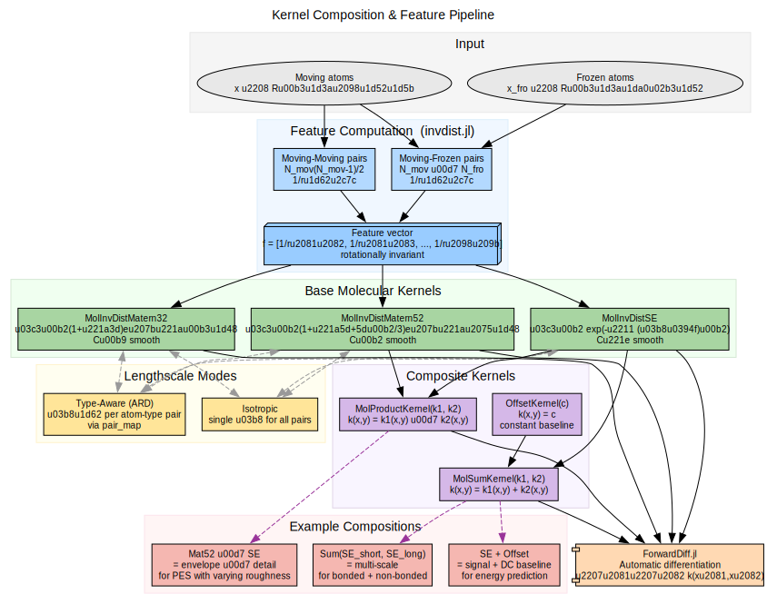

# Kernel Design

Practical guidance for choosing, configuring, and debugging molecular kernels
in ChemGP.

## Kernel Composition & Feature Pipeline



## Choosing SE vs Matern 5/2

| Property | [`MolInvDistSE`](@ref) | [`MolInvDistMatern52`](@ref) |
|:---------|:-----------|:-----------------|
| Smoothness | ``C^\infty`` | ``C^2`` |
| Best for | Smooth PES, well-separated minima | Rough PES, stiff repulsive walls |
| Risk | Over-smoothing sharp features | Slightly noisier predictions |
| Training | Faster convergence | May need more iterations |

**Rule of thumb**: Start with SE. Switch to Matern 5/2 if you observe poor GP
predictions near repulsive regions or if the optimization overshoots into
unphysical configurations.

## Adding a Constant Kernel

The [`OffsetKernel`](@ref) provides a learned baseline energy level. Without it,
the GP prior mean is zero, which can cause issues when predicting far from
training data:

```julia
k_se = MolInvDistSE(1.0, [0.5], Float64[])
k = MolSumKernel(k_se, OffsetKernel(1.0))
```

Use a constant kernel when:
- The energy scale varies significantly across the search space
- You observe poor GP predictions far from training data
- You want to match the `SexpatCF + ConstantCF` setup from gpr_optim

## Isotropic vs Type-Aware

**Isotropic** (single lengthscale) is simpler and has fewer hyperparameters to
optimize, making it suitable for:
- Homogeneous systems (all atoms are the same element)
- Prototyping and debugging
- Small systems where overfitting is a concern

**Type-aware** (per-pair lengthscales) is more expressive and suitable for:
- Heterogeneous systems (multiple elements)
- Systems where different pair types have very different interaction ranges
- Production calculations where accuracy justifies the extra parameters

## Hyperparameter Initialization

The initial values of `signal_variance` and `inv_lengthscales` matter because
Nelder-Mead is a local optimizer. Guidelines:

- **Signal variance**: Start at 1.0. The normalization in [`normalize`](@ref)
  makes this reasonable for most systems.
- **Inverse lengthscales**: Start around 0.3–1.0. Too small (< 0.1) makes the
  kernel nearly constant; too large (> 10) makes it overly sensitive to small
  displacements.

## Debugging Tips

**GP predictions are constant everywhere**: The lengthscale is too long
(inverse lengthscale too small). The kernel sees all configurations as identical.

**GP predictions are noisy/oscillatory**: The lengthscale is too short (inverse
lengthscale too large). The kernel is overfitting to noise.

**Cholesky factorization fails**: The covariance matrix is not positive definite.
Try increasing the `jitter` parameter or the noise variances.

**Training NLL is Inf**: The covariance matrix is singular. This can happen with
very similar training points. Check for duplicate configurations in the training
data.
