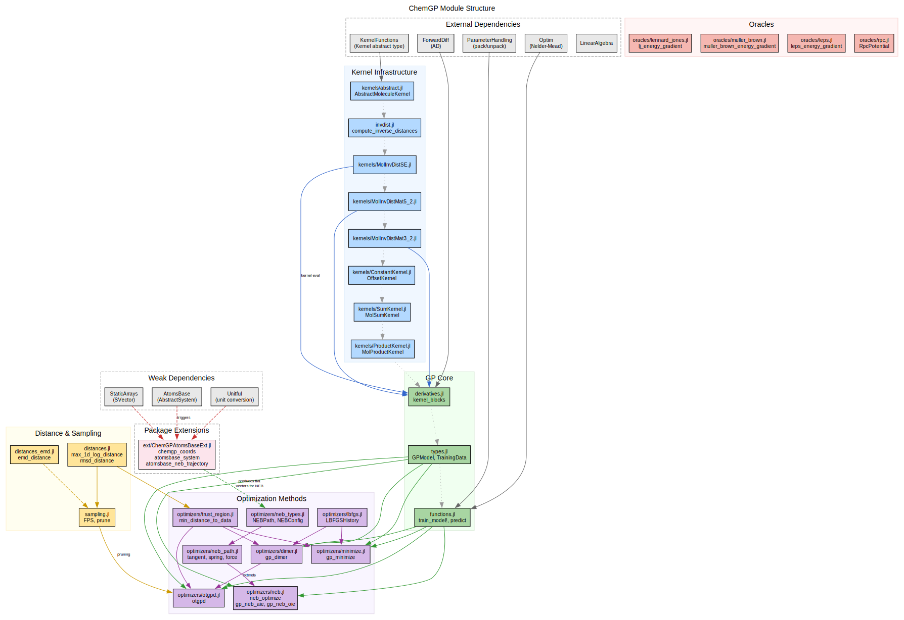

# ChemGP.jl

*Gaussian Process-guided molecular geometry optimization in Julia.*

ChemGP is a pedagogical Julia package implementing GP-guided optimization methods
for molecular systems, companion to an ACS Au tutorial on
[gpr\_optim](https://github.com/ori-cnrs/gpr_optim). It demonstrates how
Gaussian process regression with derivative observations can dramatically reduce
the number of expensive quantum chemistry evaluations needed to find minimum
energy structures and transition states.

## Key Features

- **GP regression with derivative observations**: Each oracle call provides both
  energy and gradient, giving `1 + D` observations per evaluation
- **Rotation-invariant molecular kernels**: Squared Exponential and Matern 5/2
  kernels operating on inverse interatomic distance features
- **GP-guided minimization**: Surrogate-based geometry optimization with trust regions
- **GP-Dimer saddle point search**: Find transition states using the dimer method
  accelerated by GP predictions (Goswami et al. 2025)
- **OTGPD**: Production GP-dimer with FPS subset selection, hyperparameter
  oscillation detection (HOD), variance barrier, EMD trust regions, and
  adaptive trust threshold (Goswami & Jonsson 2025)
- **GP-NEB (AIE/OIE)**: GP-accelerated nudged elastic band for minimum energy
  paths, with warm-started hyperparameters and parallel oracle evaluation
  (Goswami, Gunde & Jonsson 2026)
- **Random Fourier Features (RFF)**: Scalable GP approximation for MolInvDistSE,
  reducing prediction cost from O(N^3) to O(D_rff^3) via Bayesian linear regression
- **Remote potential integration**: Connect to external potential servers via rgpot RPC
- **Kernel composition**: Combine molecular kernels with constant offsets via `MolSumKernel`
- **AtomsBase integration**: Load structures from extxyz/POSCAR/CIF via optional package extension

## Quick Example

```julia
using ChemGP

# Create a Lennard-Jones oracle and random starting cluster
x_init = random_cluster(4)
kernel = MolInvDistSE(1.0, [0.5], Float64[])

# Run GP-guided minimization
result = gp_minimize(lj_energy_gradient, x_init, kernel)

println("Converged: ", result.converged)
println("Final energy: ", result.E_final)
println("Oracle calls: ", result.oracle_calls)
```

## Architecture Overview



## Contents

```@contents
Pages = [
    "installation.md",
    "tutorials/quickstart.md",
    "tutorials/gp_basics.md",
    "tutorials/molecular_kernels.md",
    "tutorials/minimization.md",
    "tutorials/dimer_method.md",
    "tutorials/otgpd.md",
    "tutorials/neb_method.md",
    "tutorials/rpc_integration.md",
    "guides/kernel_design.md",
    "guides/algorithms.md",
    "guides/trust_regions.md",
    "guides/comparison.md",
    "references.md",
]
Depth = 2
```
